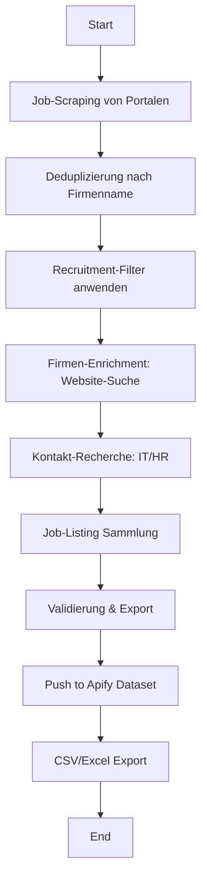

# B2B Lead Generator - IT Recruiting (Apify Actor)

🎯 **Robuster Apify Actor für B2B Lead-Generierung im IT-Recruiting-Bereich**

Extrahiert qualifizierte Firmendaten von Unternehmen im deutschen PLZ-Gebiet 5xxxx (NRW), die aktiv IT/Software-Personal suchen.

---

## 📋 Features

### ✅ Multi-Source Job-Scraping
- **Indeed.de** - Deutschlands größtes Jobportal
- **StepStone.de** - Premium-Stellenmarkt
- **Google Jobs** - Google for Jobs Integration

### 🎯 Intelligente Filterung
- **Automatischer Ausschluss** von Personalvermittlungen, Headhuntern und Zeitarbeitsfirmen
- **PLZ-basierte Filterung** (50000-59999 für NRW)
- **Deduplizierung** nach Firmennamen und Website

### 🏢 Firmen-Enrichment
- Automatische Website-Recherche via Google
- Extraktion von:
  - Impressum-Link
  - Karriere/Jobs-Seite
  - Firmenbeschreibung
  - Kontakt-Informationen

### 👥 Kontakt-Recherche (max. 2 Personen pro Firma)
**Priorisierung:**
1. **IT-Leitung**: CTO, IT-Leiter, Head of IT, IT-Manager
2. **HR-Manager**: Personalleiter, HR-Manager, Recruiting Manager

**Datenquellen:**
- Website "Team"/"Über uns" Seiten
- Impressum
- Strukturierte Daten (Schema.org)

### 📊 Strukturierter CSV/Excel-Export
- Vollständiges Daten-Schema mit 23 Spalten
- E-Mail und PLZ-Validierung
- DSGVO-konform (nur öffentliche Daten)

---

## 🚀 Quick Start

### 1. Apify Platform
```bash
# Actor auf Apify Platform erstellen
apify create b2b-lead-generator

# Code hochladen
apify push

# Actor starten
apify call
```

### 2. Lokale Entwicklung
```bash
# Dependencies installieren
pip install -r requirements.txt

# Playwright Browser installieren
playwright install chromium

# Actor lokal ausführen
apify run
```

---

## ⚙️ Konfiguration

### Input-Schema

```json
{
  "searchQueries": [
    "Software Entwickler",
    "DevOps Engineer",
    "Data Scientist"
  ],
  "locations": [
    "Köln",
    "Düsseldorf",
    "Bonn"
  ],
  "postalCodeFilter": ["5"],
  "maxResults": 50,
  "maxContactsPerCompany": 2,
  "maxJobsPerCompany": 3,
  "excludeRecruitmentAgencies": true,
  "enableContactEnrichment": true,
  "jobPortals": ["indeed", "stepstone", "google"],
  "jobDateRange": 90,
  "useProxy": true,
  "rateLimitDelay": 2.5
}
```

### Parameter-Beschreibung

| Parameter | Typ | Default | Beschreibung |
|-----------|-----|---------|--------------|
| `searchQueries` | array | `["Software Entwickler"]` | IT-Job Suchbegriffe |
| `locations` | array | `["Köln"]` | Städte im PLZ-Gebiet 5xxxx |
| `postalCodeFilter` | array | `["5"]` | PLZ-Präfix Filter |
| `maxResults` | integer | `50` | Max. Anzahl Firmen |
| `maxContactsPerCompany` | integer | `2` | Max. Kontakte pro Firma (1-2) |
| `maxJobsPerCompany` | integer | `3` | Max. Job-Listings pro Firma |
| `excludeRecruitmentAgencies` | boolean | `true` | Personalvermittlungen ausschließen |
| `enableContactEnrichment` | boolean | `true` | Kontakt-Recherche aktivieren |
| `jobPortals` | array | `["indeed", "stepstone"]` | Zu scrapende Portale |
| `jobDateRange` | integer | `90` | Jobs der letzten X Tage |
| `useProxy` | boolean | `true` | Apify Proxy verwenden |
| `rateLimitDelay` | number | `2.5` | Verzögerung zwischen Requests (Sekunden) |

---

## 📤 Output-Format

### CSV-Schema (23 Spalten)

```csv
Unternehmen,Standort,Webseiten_URL,Anrede_AP1,Vorname_AP1,Nachname_AP1,Email_AP1,Telefon_AP1,Position_AP1,Anrede_AP2,Vorname_AP2,Nachname_AP2,Email_AP2,Telefon_AP2,Position_AP2,Job1_Titel,Job1_URL,Job2_Titel,Job2_URL,Job3_Titel,Job3_URL,Erfassungsdatum
```

### Beispiel-Datensatz

```csv
Tech Solutions GmbH,50667 Köln,https://techsolutions.de,Herr,Thomas,Müller,t.mueller@techsolutions.de,+49 221 12345,CTO,Frau,Sandra,Schmidt,s.schmidt@techsolutions.de,+49 221 12346,HR Manager,Senior Java Entwickler,https://techsolutions.de/jobs/java,DevOps Engineer,https://techsolutions.de/jobs/devops,Python Developer,https://techsolutions.de/jobs/python,2025-11-15 10:30:00
```

### JSON-Output (Apify Dataset)

```json
{
  "company_name": "Tech Solutions GmbH",
  "location": "50667 Köln",
  "website": "https://techsolutions.de",
  "contacts": [
    {
      "salutation": "Herr",
      "first_name": "Thomas",
      "last_name": "Müller",
      "email": "t.mueller@techsolutions.de",
      "phone": "+49 221 12345",
      "position": "CTO"
    },
    {
      "salutation": "Frau",
      "first_name": "Sandra",
      "last_name": "Schmidt",
      "email": "s.schmidt@techsolutions.de",
      "phone": "+49 221 12346",
      "position": "HR Manager"
    }
  ],
  "jobs": [
    {
      "title": "Senior Java Entwickler",
      "url": "https://techsolutions.de/jobs/java"
    },
    {
      "title": "DevOps Engineer",
      "url": "https://techsolutions.de/jobs/devops"
    }
  ]
}
```

---

## 🛡️ Ausschlusskriterien

### Automatisch gefilterte Firmen
- **Personalvermittlungen**: Keywords wie "Personalvermittlung", "Headhunter"
- **Zeitarbeitsfirmen**: "Zeitarbeit", "Leiharbeit", "Arbeitnehmerüberlassung"
- **Recruiting-Agenturen**: "Recruiting GmbH", "Personalberatung"

### Bekannte Agenturen (Blacklist)
Adecco, Randstad, Manpower, Hays, Robert Half, Michael Page, Amadeus Fire, Kelly Services, Brunel, Ferchau, Orizon, GULP, SOLCOM, FreelancerMap

---

## 📊 Validierung & Qualität

### Pflichtfelder pro Lead
✅ Firmenname
✅ Standort
✅ Website
✅ Mindestens 1 Ansprechpartner mit E-Mail
✅ Mindestens 1 Job-Listing

### Validierungen
- **E-Mail**: RFC-konform + Business-E-Mail (keine Freemail)
- **PLZ**: 5-stellig, Präfix-Filter
- **Telefon**: Internationale Formatierung (E.164)
- **Deduplizierung**: Nach normalisiertem Firmennamen

---

## 🔧 Technische Details

### Architektur

```
src/
├── main.py                 # Haupt-Orchestrator
├── scrapers/              # Job-Portal Scrapers
│   ├── indeed_scraper.py
│   ├── stepstone_scraper.py
│   └── google_jobs_scraper.py
├── enrichment/            # Firmen & Kontakt-Enrichment
│   ├── company_enricher.py
│   └── contact_finder.py
├── filters/               # Ausschlussfilter
│   └── recruitment_filter.py
└── utils/                 # Helper, Validators, Exporter
    ├── validators.py
    ├── helpers.py
    └── exporters.py
```

### Performance-Optimierung
- **Rate Limiting**: 2-3 Sekunden zwischen Requests
- **Retry-Logik**: Max. 3 Versuche mit exponential backoff
- **Apify Proxy**: Residential Proxy für Anti-Bot-Schutz
- **Caching**: Deduplizierung bereits verarbeiteter Firmen

### Error Handling
- Try-Catch auf allen externen Requests
- Graceful Degradation (partielle Daten bei Fehlern)
- Detailliertes Logging für Debugging

---

## 📈 Workflow



---

## 🔒 Compliance & Datenschutz

### DSGVO-Konformität
✅ Nur öffentlich zugängliche Daten
✅ Kein Scraping Login-geschützter Bereiche
✅ Robots.txt wird respektiert
✅ User-Agent Header gesetzt
✅ Transparente Datenherkunft (Source-Tracking)

### Best Practices
- Rate Limiting zum Schutz der Ziel-Server
- Keine sensiblen Daten (Passwörter, etc.)
- Business-E-Mails bevorzugt (keine privaten Freemail-Adressen)

---

## 🐛 Troubleshooting

### Problem: Keine Jobs gefunden
**Lösung**:
- Prüfe ob Suchbegriffe zu spezifisch sind
- Erweitere `locations` Array
- Reduziere `jobDateRange` (z.B. auf 30 Tage)

### Problem: Keine Kontakte gefunden
**Lösung**:
- Website hat möglicherweise keine Team-Seite
- Impressum nicht erkannt → Manuelle Überprüfung
- `enableContactEnrichment: false` deaktiviert Kontakt-Recherche

### Problem: Zu viele Personalvermittlungen
**Lösung**:
- `excludeRecruitmentAgencies: true` aktivieren
- Erweitere `EXCLUSION_KEYWORDS` in `recruitment_filter.py`

### Problem: Rate Limiting / IP-Blocks
**Lösung**:
- Erhöhe `rateLimitDelay` (z.B. auf 5 Sekunden)
- Aktiviere `useProxy: true` für Apify Residential Proxy
- Reduziere `maxResults`

---

## 📝 Beispiel-Verwendung

### Szenario 1: Köln IT-Recruiting
```json
{
  "searchQueries": ["Software Entwickler", "Java Developer"],
  "locations": ["Köln", "50667", "50823"],
  "maxResults": 30,
  "jobPortals": ["indeed", "stepstone"]
}
```

### Szenario 2: NRW-weite DevOps-Suche
```json
{
  "searchQueries": ["DevOps Engineer", "Site Reliability Engineer"],
  "locations": ["Düsseldorf", "Dortmund", "Essen", "Köln", "Bonn"],
  "postalCodeFilter": ["5"],
  "maxResults": 100,
  "jobDateRange": 60
}
```

### Szenario 3: Data Science Spezialisten
```json
{
  "searchQueries": ["Data Scientist", "Machine Learning Engineer", "AI Engineer"],
  "locations": ["Köln", "Düsseldorf"],
  "maxResults": 25,
  "maxContactsPerCompany": 2,
  "enableContactEnrichment": true
}
```

---

## 🔄 Updates & Roadmap

### Aktuelle Version: 1.0.0

### Geplante Features (v1.1)
- [ ] LinkedIn API Integration
- [ ] XING API Integration
- [ ] Erweiterter Firmendaten-Export (Mitarbeiteranzahl, Umsatz)
- [ ] E-Mail-Verifikation (SMTP-Check)
- [ ] Sentiment-Analyse der Job-Beschreibungen
- [ ] Multi-Sprach-Support (EN, FR)

---

## 📞 Support

Bei Fragen oder Problemen:
1. **Logs prüfen**: Apify Actor Logs für Fehler-Details
2. **Input validieren**: Siehe `example_input.json`
3. **Issue erstellen**: GitHub Issues für Bug-Reports

---

## 📄 Lizenz

Dieses Projekt ist für den internen Gebrauch bestimmt. Beim Scraping öffentlicher Websites sind die jeweiligen Nutzungsbedingungen und Datenschutzrichtlinien zu beachten.

---

## 🙏 Credits

**Entwickelt mit:**
- Apify SDK (Python)
- BeautifulSoup4 (HTML Parsing)
- Playwright (Browser Automation)
- Pandas (Data Processing)

**Job-Portale:**
- Indeed.de
- StepStone.de
- Google Jobs

---

**Viel Erfolg bei der Lead-Generierung! 🚀**
